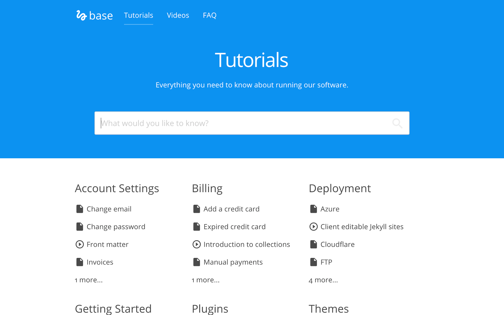

# Base

Knowledge base template for Jekyll. Browse through a [live demo](https://orange-ape.cloudvent.net/).



Base was made by [CloudCannon](http://cloudcannon.com/), the Cloud CMS for Jekyll.

Find more templates, themes and step-by-step Jekyll tutorials at [CloudCannon Academy](https://learn.cloudcannon.com/).

## Features

* Tutorials organised by category
* Two types of tutorials - text and video
* Ability to have a "tutorial series"
* FAQ section
* Disqus comments
* Sticky sidebar for main headings in tutorials
* Optimised for editing in [CloudCannon](http://cloudcannon.com/)
* RSS/Atom feed
* SEO tags
* Google Analytics

## Setup

1. Add your site and author details in `_config.yml`.
2. Add your Google Analytics, Disqus and MailChimp keys to `_config.yml`.
3. Get a workflow going to see your site's output (with [CloudCannon](https://app.cloudcannon.com/) or Jekyll locally).

## Develop

Base was built with [Jekyll](http://jekyllrb.com/) version 3.4.3, but should support newer versions as well.

Install the dependencies with [Bundler](http://bundler.io/):

~~~bash
$ bundle install
~~~

Run `jekyll` commands through Bundler to ensure you're using the right versions:

~~~bash
$ bundle exec jekyll serve
~~~

## Editing

Base is already optimised for adding, updating and removing tutorials, navigation, footer and FAQ information in CloudCannon.

The sticky sidebar in tutorials in populated by pulling out `<h2>` elements from the content.

### Posts

* Add, update or remove a post in the *Posts* collection.
* The tutorials page is organised by categories.
* Change the defaults when new posts are created in `_posts/_defaults.md`.

### Post Series
To create a new series:

* Add a new document to the `sets` collection.
* Set the `title` and `description`.

To add a tutorial/post to a series:
* Add a `set` field to the tutorial front matter which points to the file name of the desired set without the `.md` extention. e.g. If I have a set at `_sets/getting-started.md` I would use this in my tutorial front matter: `set: getting-started`.
* Add a `set_order` field to the tutorial front matter and specify a number. This is the tutorials order in the set.

### Navigation

* Exposed as a data file to give clients better access.
* Set in the *Data* / *Navigation* section.

### Footer

* Exposed as a data file to give clients better access.
* Set in the *Data* / *Footer* section.


## Welcome to GitHub Pages

You can use the [editor on GitHub](https://github.com/intrpr/jeykll-test/edit/master/README.md) to maintain and preview the content for your website in Markdown files.

Whenever you commit to this repository, GitHub Pages will run [Jekyll](https://jekyllrb.com/) to rebuild the pages in your site, from the content in your Markdown files.

### Markdown

Markdown is a lightweight and easy-to-use syntax for styling your writing. It includes conventions for

```markdown
Syntax highlighted code block

# Header 1
## Header 2
### Header 3

- Bulleted
- List

1. Numbered
2. List

**Bold** and _Italic_ and `Code` text

[Link](url) and 
```

For more details see [GitHub Flavored Markdown](https://guides.github.com/features/mastering-markdown/).

### Jekyll Themes

Your Pages site will use the layout and styles from the Jekyll theme you have selected in your [repository settings](https://github.com/intrpr/jeykll-test/settings). The name of this theme is saved in the Jekyll `_config.yml` configuration file.

### Support or Contact

Having trouble with Pages? Check out our [documentation](https://help.github.com/categories/github-pages-basics/) or [contact support](https://github.com/contact) and we’ll help you sort it out.
